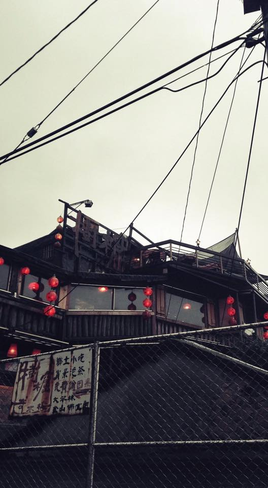
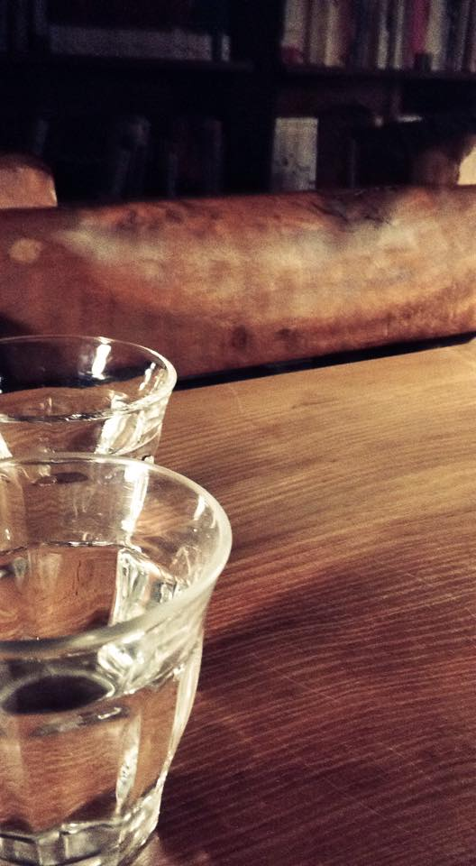
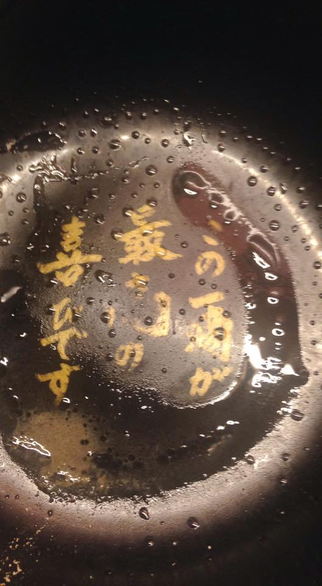

# jquery-photoWall

version 2.0.0

# How to use

<!--include css-->
<link rel="stylesheet" href="animate.css">
<link rel="stylesheet" href="style.css">

<!--include js-->

<!--content-->

    <ul>
        <li></li>
        <li></li>
        <li></li>
        <li></li>
        <li></li>
        <li></li>
        <li></li>
    </ul>

# Options

_this.options = {
	imgWidth : 0, //set img width
	imgHeight : 0, //set img height or auto
	oneLineMaxLength : 3, // set image of numbers in row
	showMax : 6, //set all show Images
	init : 1000, // init delay, false for no delay (integer or boolean)
	effect : 'zoomInUp', // init animation effect
	speed : 3000, // transition speed, false for no transition (integer or boolean)
	duration : 1000, // animation speed
	imgSort : 'single', // sort image method ('single' or 'random')
	changeSytle : 'loop', // images display style ('loop' or 'random')
	loopSpeed : 10, // if u chice 'loop' , u can set animation speed level (1 ~ 10)
	changeEffect : 'flipInY', // play animation effect
	hoverStop: true, // paly and stop on hover
	autoplay : true, // enable autoplay on initialisation
	fluid : true // is it a percentage width? (boolean) RWD
};